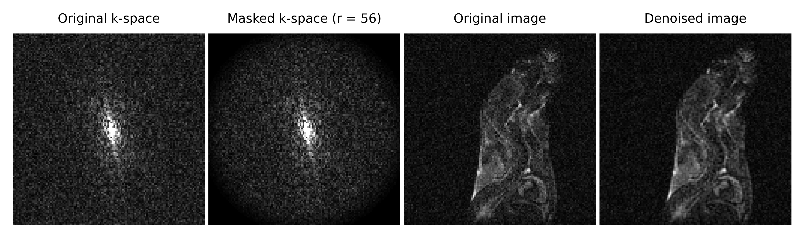
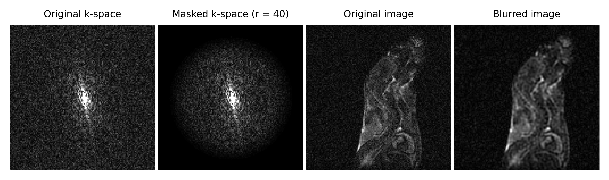

# k-space_masking_for_MRI_denoising

Graduate k-space masking for MRI image denoising and blurring (on the example of Agilent FID data).

## The repository contains:
1. Python script **grad_mask_kspace.py**.
2. **Description.pdf** presenting:
- short introduction to the topic,
- how the code works,
- sample results.
3. Sample FID data in the **mems_20190406_02.fid** folder.
4. Sample results illustration in **Fig1.png** and **Fig2.png**.

## Literature reference (for the sample data)
Beata Wereszczyńska, ***Alcohol-fixed specimens for high-contrast post-mortem MRI***, Forensic Imaging, Volume 25, 2021, 200449, ISSN 2666-2256, https://doi.org/10.1016/j.fri.2021.200449. (https://www.sciencedirect.com/science/article/pii/S2666225621000208)

## License
The software is licensed under the **MIT license**. The non-software content of this project is licensed under the **Creative Commons Attribution 4.0 International license**. See the LICENSE file for license rights and limitations.

## You may also like
**k-space_wght_msk_for_MRI_denoising** - k-space weighting and masking for denoising of MRI image without blurring or losing contrast, as well as for brightening of the objects in the image with simultaneous noise reduction (on the example of Agilent FID data), https://doi.org/10.5281/zenodo.7367057 (https://github.com/BeataWereszczynska/k-space_wght_msk_for_MRI_denoising).

**MRI_k-space-derived_details_edges** - k-space based details/edges detection in MRI images with optional k-space based denoising and detail control
(data import suitable for Agilent FID files, three binarization methods to choose from), https://doi.org/10.5281/zenodo.7388435 (https://github.com/BeataWereszczynska/MRI_k-space-derived_details_edges).
